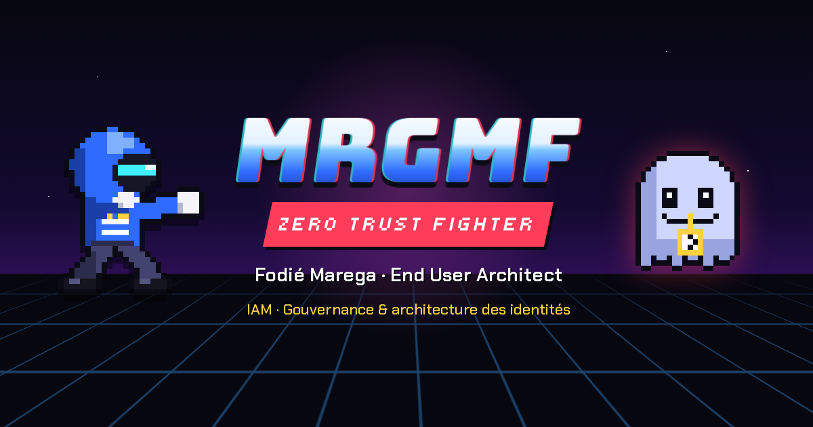

# MRGMF · Zero Trust Fighter

Le portfolio jouable de **Fodié Marega**, End User Architect spécialisé **IAM : gouvernance et architecture des identités**.

**En ligne : [mrgmf.github.io](https://mrgmf.github.io/)** · [English version](https://mrgmf.github.io/en/)

Le site est une borne d'arcade façon jeu de combat. Chaque projet est un adversaire à battre, chaque compétence est une manipulation (236P, 623K…) qu'on peut exécuter au clavier ou à la manette. Pour lire sans jouer, le **mode lecture** affiche tout le contenu sur une page classique et accessible, sans animation. C'est aussi ce qu'on voit sans JavaScript.



## Ce qu'il y a dedans

| Écran | Contenu |
| --- | --- |
| Écran titre | Press start, pixel art, fond synthwave |
| Sélection | Les projets en adversaires, un aperçu joueur 1 / joueur 2, un tirage aléatoire et un adversaire secret |
| Combats | LearnLink (MFA, OAuth, SIEM), gouvernance des identités chez Louis Vuitton, Hotel.java, ProjecTTrone, ce portfolio |
| Move list | Les compétences sous forme de manipulations, avec détection réelle des inputs |
| Fiche combattant | Spécialité, style et costumes alternatifs |
| Contact | Challenger en approche |

Petits bonus : un code célèbre débloque un adversaire secret, la manette est prise en charge (Gamepad API), les bruitages sont synthétisés en direct (Web Audio, coupés par défaut), et un affichage des entrées apparaît comme en mode entraînement.

## Choix techniques

- **Zéro framework, zéro dépendance à l'exécution** : HTML, CSS et JavaScript natifs (modules ES).
- **Site statique généré** par `scripts/build.mjs` (Node, sans dépendance) à partir de `src/`. Les pages générées sont versionnées et servies telles quelles par GitHub Pages.
- **Pixel art dessiné par code** (`src/pixel.mjs`, `src/sprites.mjs`) : des formes, un contour automatique, puis une planche de symboles SVG. Chaque sprite n'est écrit qu'une fois par page.
- **Deux modes pour un même contenu** : `data-mode="game"` (un écran à la fois) et `data-mode="reading"` (page classique, rendu par défaut sans JS).
- **Accessibilité** : navigation complète au clavier, annonces pour lecteur d'écran, `prefers-reduced-motion` respecté (pas d'écran VS, pas de clignotement), contrastes AA vérifiés avec axe-core.
- **Bilingue FR / EN**, avec `hreflang`, une image de partage par langue, un sitemap et des données structurées `Person`.
- **Polices auto-hébergées** sous licence OFL : Bungee, Chakra Petch et Tiny5.

## Modifier le contenu

Tout le texte est dans `src/content/fr.mjs` et `src/content/en.mjs`, avec la même structure dans les deux fichiers. Le build refuse de générer le site si les deux langues n'ont pas les mêmes projets ou la même move list.

```bash
npm run build   # régénère index.html, en/index.html, 404.html, sitemap…
npm run check   # build + vérifications (ancres, fichiers, métadonnées)
npm run dev     # build + serveur local sur http://localhost:4173
```

Pour ajouter un projet, ajoute une entrée dans `stages` (dans les deux langues), choisis un boss dans `src/sprites.mjs` ou dessines-en un nouveau, puis lance `npm run build`.

Les images PNG (aperçu social et icônes) se régénèrent avec `node scripts/render-images.mjs`. Cette commande demande Playwright : `npm i -D playwright`.

## Structure

```
src/
  content/fr.mjs, en.mjs   tout le texte du site
  templates/page.mjs       gabarits HTML
  pixel.mjs, sprites.mjs   moteur de pixel art et sprites
scripts/
  build.mjs                génération du site
  check.mjs                vérifications
  serve.mjs                serveur local
  render-images.mjs        images PNG (optionnel)
assets/
  css/site.css             styles des deux modes
  js/                      main (écrans), input (clavier, manette, manipulations),
                           stage (combats), audio (Web Audio), util
  fonts/, img/
index.html, en/, 404.html  pages générées (ne pas modifier à la main)
```

## Licence

Code sous licence MIT. Les textes, le pixel art et l'identité visuelle « MRGMF » sont © Fodié Marega. Les polices sont sous licence SIL OFL 1.1 (fichiers dans `assets/fonts/`).

---

*English: a playable, arcade-style portfolio focused on identity governance and architecture (IAM). No framework, no runtime dependency, readable without JavaScript. Edit `src/content/*.mjs`, then run `npm run build`.*
